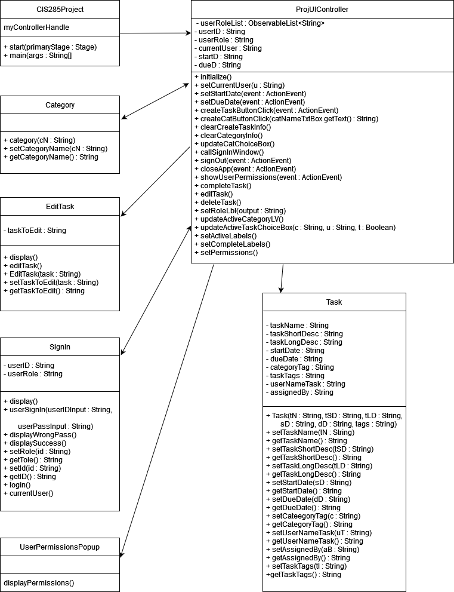

# CIS285ToDoApp
Repo for Jeff State CIS 285 group project

System Requirements
    - Java Version: JDK 17
    - JavaFX Version: JavaFX 17
    - IDE: NetBeans 12.5

Key Features
    -	A tab-based application that will allow the user to perform various functions based on the active tab 100%
    -	Users can sign in via the menu at the top of the application window 95%
        •	After signing in, the application will update so that the user will only see tasks and features that relate to their account and role 100%
    -	UI features are locked based on the user role. Users with higher level roles are allowed to do more important actions within the application for security and productivity purposes 100%
    -	The Menu at the top of the application window allows the user to select options to Sign In, Sign Out, Exit the application, and view a summary of the permissions allowed for the different account roles 98%
        •	The Sign In option opens a Sign In popup window for the user to enter their UserID and password 100%
    -	The Active and Completed task tabs will be personalized based on the active user. 100%
        •	The left side contains a list of the existing categories for the organization’s tasks. 100%
            	The categories can be selected to only show the user’s tasks that are in the selected category 100%
        •	The right side contains a ChoiceBox that displays the user’s active tasks 100%
            	Selecting a task from the ChoiceBox causes the area below the Box to display all information for the task 95%
        •	The completed and selected CheckBoxes on the right side allow users with the appropriate permissions to interact with the selected task. 50%
            	The complete CheckBox will allow users to mark the task selected from the ChoiceBox as complete by pressing the complete button at the bottom of the window 75%
            	The selected CheckBox will allow the user to edit or delete the task selected from the CheckBox by pressing the edit or delete button at the bottom of the window 75%
    -	The Create tab allows users with the appropriate permissions to create both tasks and categories 100%
        •	The tab contains TextFields, DatePickers, and a ChoiceBox that will accept input to assign the information for the task. 100%
        •	Clicking the create task button will save all information for the new task and the information will be saved in a database 100%
        •	Clicking the create category button will save the input for the new category name and save it in the database. 100%
            	Doing this will also cause the new category to appear in the category list on the Active and Completed tabs 100%
    -  	The Account Management tab allows users with appropriate permissions to update the information associated with their account 50%
        •	Administrators can use the bottom section to update the information for any user account 50%
        •	Clicking the update buttons will save changes to the database only for fields that have input 50%
    -	The User Creation tab allows users with appropriate permissions to create a new account. 50%
        •	Clicking the Create button saves the account to the database and allows it to become an active account 50%
    -	The Label in the bottom-left of the application window displays the UserID and Role of the currently signed in account 99%
    -	The buttons on the bottom of the application window allow users with appropriate permissions to interact with the task that is currently selected from the Active and Completed Task tabs 75%
        •	The Complete button completes the selected task when the Complete CheckBox is selected 75%
        •	The Edit button allows the user to edit the selected task through a popup window when the Selected CheckBox is selected 75%
            	The Edit Task popup window contains TextFields, DatePickers, and a ChoiceBox for user input. 100%
            	When the Button is pressed, the only information that is updated are the elements that have input 50%
        •	The Delete button allows the user to delete the selected task when the Selected CheckBox is selected 75%

