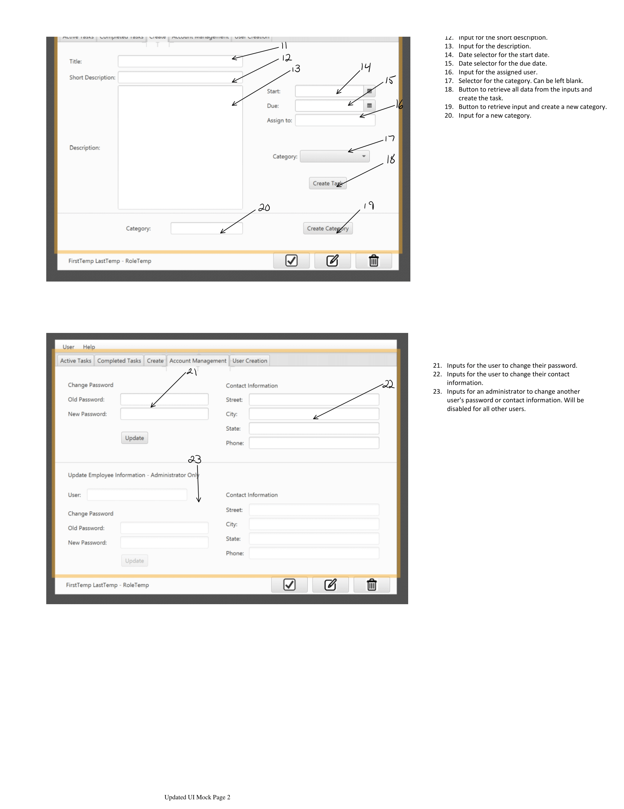

# CIS285ToDoApp
Repo for Jeff State CIS 285 group project

Java Version: JDK 17
JavaFX Version: JavaFX 17
IDE: NetBeans 12.5

This application is designed to allow a business to manage tasks for their employees.
    Features:
        -Allows for the creation and management of user profiles. 
            -User profile allows the user to see only tasks assigned to them.
            -User profiles are assigned a role, which gives them different abilites to modify tasks and user accounts.
        -Tasks can be sorted by category, or viewed in a list of all tasks.
        -Tasks are initially viewed in a collapsed state, with a short description and due date visible.
        -Tasks can be clicked on to expand them. The expanded form displays all information for the task.
        -The create tab allows users with the appropriate permissions to create tasks and assign them to users, as well as create new categories
        -The account management tab allows the user to change their password and contact information, and allows users with administrator privilages to change information for other users
        -The user creation tab allows for the creation of acccounts

